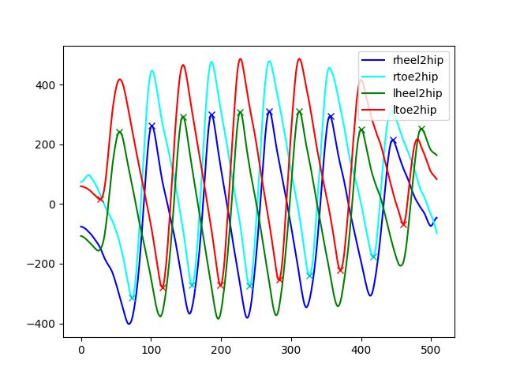
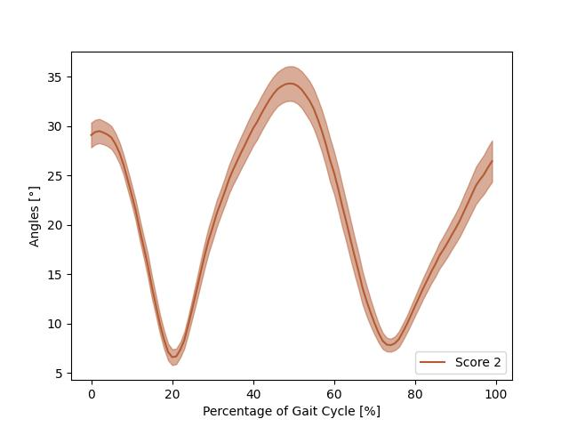

[README.md](https://github.com/user-attachments/files/24334781/README.md)
# TULIP

以下是原文README.md的内容，能够运行一个包含三个受试者7，8，13的步态特征提取demo并可视化，由于完整的TULIP数据集具有隐私性，暂时无法获取，所以我在原demo的基础上实现对原论文步态部分的模型训练、预测UPDRS评分和二元PD/健康分类，并做出和原论文一样的建模步骤和统计标准，为了保证实验的运行我写了一个requirements.txt来帮助环境建设。

## **原README.md:**

This repository holds the demo data, gait feature extraction and visualization code for the paper:

[**TULIP: Multi-camera 3D Precision Assessment of Parkinson’s Disease**](https://openaccess.thecvf.com/content/CVPR2024/papers/Kim_TULIP_Multi-camera_3D_Precision_Assessment_of_Parkinsons_Disease_CVPR_2024_paper.pdf) Kyungdo Kim, Sihan Lyu, Sneha Mantri and Timothy W. Dunn, CVPR 2024. 

For more information, please visit our [TULIP project website](https://www.tulipproject.net/). 

## Demo data - "ThreeSubjects_GaitPoses.pkl"

We provide three subjects' gait poses data saved in the file "ThreeSubjects_GaitPoses.pkl". Subject 7, 8 and 13 gait behaviors were respectively labeled as score 0, 1 and 2 by experienced clinicians, based on UDPRS criteria. The pose data for each subject is saved as a NumPy array with a shape of (4801, 26, 3), where 4801 represents the number of frames, 26 indicates the number of key points, and 3 denotes the three dimensions. The pose format is based on Halpe26. You can visit their Github [page](https://github.com/Fang-Haoshu/Halpe-FullBody) for detailed information.

## Complete dataset

Our complete dataset information is published in Zenodo. Please visit the [page](https://zenodo.org/records/14517699) for more information. 

## Gait feature extraction - "extract_features.py"

We provide the code for extracting gait features and it can generate plots to visualize detected gait events - heel-strike and toe-off. The cross sign represents the detected gait events. All plots are in the "validation_figures" folder.

<div align="center">
    
</div>

## Gait angle visualization - "plot_angles.py"

We provide the code for visualizing specific angles during the gait cycle. Here we show an example to visualize angles between two legs during the whole gait cycle.

<div align="center">
    
</div>

## Citation

Please cite the following paper if you use this repository in your research.

```
@InProceedings{Kim_2024_CVPR,
    author    = {Kim, Kyungdo and Lyu, Sihan and Mantri, Sneha and Dunn, Timothy W.},
    title     = {TULIP: Multi-camera 3D Precision Assessment of Parkinson's Disease},
    booktitle = {Proceedings of the IEEE/CVF Conference on Computer Vision and Pattern Recognition (CVPR)},
```

## License

Shield: [![CC BY-NC 4.0][cc-by-nc-shield]][cc-by-nc]

This work is licensed under a
[Creative Commons Attribution-NonCommercial 4.0 International License][cc-by-nc].

[![CC BY-NC 4.0][cc-by-nc-image]][cc-by-nc]

[cc-by-nc]: https://creativecommons.org/licenses/by-nc/4.0/
[cc-by-nc-image]: https://licensebuttons.net/l/by-nc/4.0/88x31.png
[cc-by-nc-shield]: https://img.shields.io/badge/License-CC%20BY--NC%204.0-lightgrey.svg
    month     = {June},
    year      = {2024},
    pages     = {22551-22562}

}

## **我的复现：**

我在原demo的基础上添加了tulip_rf_experiment.py，它的功能是建模原论文中在步态特征方面F1score得分最高的随机森林模型，并且进行训练和验证，最后生成相应的实验报告TULIP_复现实验报告.md，由于实验数据集受限，结果可能与原文相差较大，但是思想内容核心一致。

环境配置步骤：

1. 创建并激活conda环境

conda create -n tulip python=3.8 -y
conda activate tulip   

2. 安装所有依赖

pip install -r requirements.txt

3. 验证安装

python -c "import numpy, pandas, scipy, sklearn, matplotlib, cv2; print('所有依赖安装成功！')"

运行实验的步骤是：

python extract_features.py

python plot_angles.py

python tulip_rf_experiment.py

由于已经提取了特征保存在ThreeSubjects_GaitFeatures.pkl，所以也可以直接运行python tulip_rf_experiment.py。
